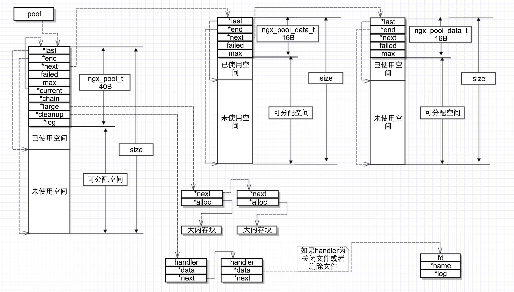
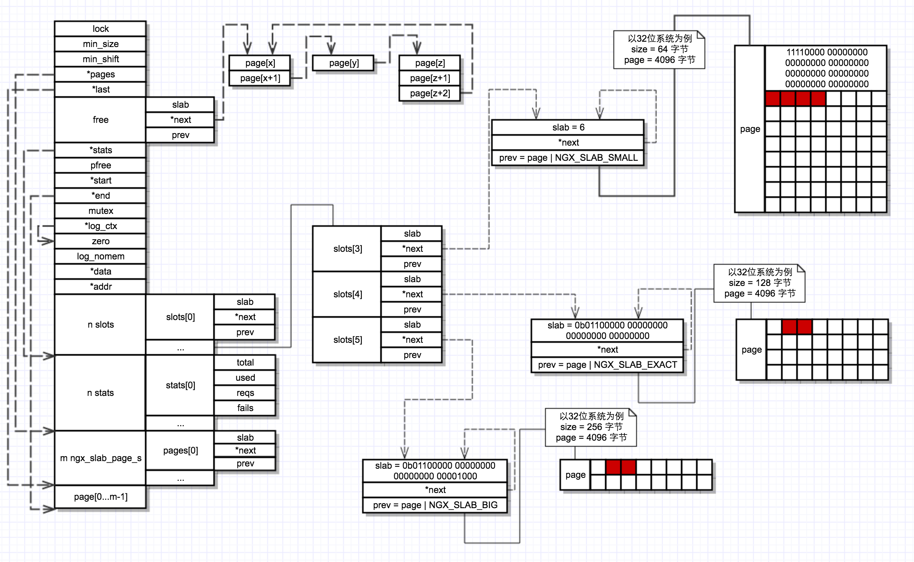
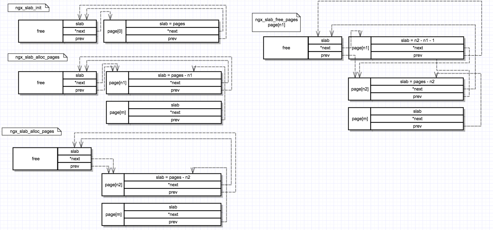

# nginx 1.11.7 内存分配策略
源代码中也加了部分注释

## 为什么需要内存分配策略？
```
像http请求这种快速申请快速释放内存资源的，如果用malloc/free来管理内存会有很多次的系统调用

```
## ngx_pool
./src/core/ngx_palloc.h/.c

```
特点：所有内存块的生命周期和 pool 一样（除了 large 内存块可以单独释放），方便统一管理
比如一个 http 连接就可以用这样一个 pool，关闭 http 连接时调用 ngx_destroy_pool 进行销毁
开发者只需要考虑内存的申请而不需要考虑内存的释放
```
</img>
### pool 相关
#### 创建 pool
```
ngx_pool_t *
ngx_create_pool(size_t size, ngx_log_t *log);

    // 为pool申请内存，内存起始地址为 NGX_POOL_ALIGNMENT（默认为16字节） 的整数倍
    p = ngx_memalign(NGX_POOL_ALIGNMENT, size, log);

    // 设置大内存和小内存的界限，小内存最大不能超过虚拟内存的一页（比如x86是4095），也不能大于该pool节点可以分配的空间
    size = size - sizeof(ngx_pool_t);
    p->max = (size < NGX_MAX_ALLOC_FROM_POOL) ? size : NGX_MAX_ALLOC_FROM_POOL;
    
    // 其它参数
    p->d.last = (u_char *) p + sizeof(ngx_pool_t);
    p->d.end = (u_char *) p + size;
    p->current = p;
    p->log = log;
```
#### 销毁 pool
```
void
ngx_destroy_pool(ngx_pool_t *pool)

    // 执行清理函数
    for (c = pool->cleanup; c; c = c->next) {
        if (c->handler) {
            ngx_log_debug1(NGX_LOG_DEBUG_ALLOC, pool->log, 0,
                           "run cleanup: %p", c);
            c->handler(c->data);
        }
    }

    // 释放大内存块
    for (l = pool->large; l; l = l->next) { 
        if (l->alloc) {
            ngx_free(l->alloc);
        }
    }

    // 释放pool节点
    for (p = pool, n = pool->d.next; /* void */; p = n, n = n->d.next) { 
        ngx_free(p);

        if (n == NULL) {
            break;
        }
    }
```
#### 重置 pool
```
void
ngx_reset_pool(ngx_pool_t *pool)

    // 释放大内存块
    for (l = pool->large; l; l = l->next) { 
        if (l->alloc) {
            ngx_free(l->alloc);
        }
    }

    // 重置last指针和failed
    for (p = pool; p; p = p->d.next) {     
        p->d.last = (u_char *) p + sizeof(ngx_pool_t);
        p->d.failed = 0;
    }
```

### 申请和释放内存
#### 向pool申请内存
```
    void *
    ngx_palloc(ngx_pool_t *pool, size_t size) // 内存对齐

    void *
    ngx_pnalloc(ngx_pool_t *pool, size_t size) // 不考虑内存对齐

    void *
    ngx_pcalloc(ngx_pool_t *pool, size_t size) // 内存对齐并初始化为0
```
#### 向pool申请小内存块
```
// 遍历pool每个节点，如果未使用空间大于size就分配
// 如果所有节点的未使用空间都不够，那就新建一个节点
// 通过align参数来决定是否进行内存对齐
static ngx_inline void *
ngx_palloc_small(ngx_pool_t *pool, size_t size, ngx_uint_t align)
    m = p->d.last;
    if (align) {
        m = ngx_align_ptr(m, NGX_ALIGNMENT); // #define NGX_ALIGNMENT   sizeof(unsigned long) 
    }
    if ((size_t) (p->d.end - m) >= size) {
        p->d.last = m + size;
        return m;
    }
    #define ngx_align_ptr(p, a)                                                   \
    (u_char *) (((uintptr_t) (p) + ((uintptr_t) a - 1)) & ~((uintptr_t) a - 1))
```
#### 新建pool节点
```
static void *
ngx_palloc_block(ngx_pool_t *pool, size_t size)
    psize = (size_t) (pool->d.end - (u_char *) pool);
    m = ngx_memalign(NGX_POOL_ALIGNMENT, psize, pool->log);
    m += sizeof(ngx_pool_data_t);
    m = ngx_align_ptr(m, NGX_ALIGNMENT);
    new->d.last = m + size;

    // 如果分配小内存失败5次及以上，将 current 指针前移，下次分配小内存直接从这里开始
    for (p = pool->current; p->d.next; p = p->d.next) {
        if (p->d.failed++ > 4) {
            pool->current = p->d.next;
        }
    }
```
#### 向pool申请大内存块
```
static void *
ngx_palloc_large(ngx_pool_t *pool, size_t size)
    // p里面存储着大内存块的数据
    p = ngx_alloc(size, pool->log);

    // 如果 large 链表的前3项中有 alloc 是指向 null 的，那么将该 alloc 指向 p
    n = 0;
    for (large = pool->large; large; large = large->next) {
        if (large->alloc == NULL) {
            large->alloc = p;
            return p;
        }

        if (n++ > 3) {
            break;
        }
    }

    // 新建一个 ngx_pool_large_t 结构，结构本身保存在小内存块中，然后将该结构插入到 large 链表的头部
    large = ngx_palloc_small(pool, sizeof(ngx_pool_large_t), 1);
    if (large == NULL) {
        ngx_free(p);
        return NULL;
    }
    large->alloc = p;
    large->next = pool->large;
    pool->large = large;
void *
ngx_pmemalign(ngx_pool_t *pool, size_t size, size_t alignment)
    向内存池申请大内存，新建 ngx_pool_large_t 直接挂在到large链表的头部，其中的 alloc 指向新分配的内存，
```
#### 释放pool中的指定大内存块
```
ngx_int_t
ngx_pfree(ngx_pool_t *pool, void *p)

    // 释放空间但不删除 ngx_pool_large_t 的节点
    for (l = pool->large; l; l = l->next) {
        if (p == l->alloc) {
            ngx_log_debug1(NGX_LOG_DEBUG_ALLOC, pool->log, 0,
                           "free: %p", l->alloc);
            ngx_free(l->alloc);
            l->alloc = NULL;

            return NGX_OK;
        }
    }
```

### 清理函数相关
#### 添加清理函数
```
ngx_pool_cleanup_t *
ngx_pool_cleanup_add(ngx_pool_t *p, size_t size)
    // 每次插入也是插入到头节点
```
#### 运行关闭文件函数
```
void
ngx_pool_run_cleanup_file(ngx_pool_t *p, ngx_fd_t fd)
    // 关闭保存在该 pool 中的所有文件
    for (c = p->cleanup; c; c = c->next) {
        if (c->handler == ngx_pool_cleanup_file) {
            cf = c->data;
            if (cf->fd == fd) {
                c->handler(cf);
                c->handler = NULL;
                return;
            }
        }
    }
```
#### pool中常见的清理函数 (cleanup->handler)
还有许多其它的清理函数在别的文件中定义
```
void
ngx_pool_cleanup_file(void *data) // 关闭文件

void
ngx_pool_delete_file(void *data)  // 删除并关闭文件
```

## ngx_slab
./src/core/ngx_slab.h/.c
```
基于页的内存分配
特点：预分配，按照SIZE对内存进行分类管理
```
</img>
### slab 相关
#### 初始化 slab
```
void
ngx_slab_init(ngx_slab_pool_t *pool)

    // 初始化一些静态全局变量，最大分配空间为页大小的一半，精确分配大小，计算对应位移数
    if (ngx_slab_max_size == 0) {
        ngx_slab_max_size = ngx_pagesize / 2; 
        ngx_slab_exact_size = ngx_pagesize / (8 * sizeof(uintptr_t));
        for (n = ngx_slab_exact_size; n >>= 1; ngx_slab_exact_shift++) {
            /* void */
        }
    }
```
### 申请和释放内存
```
void *
ngx_slab_alloc(ngx_slab_pool_t *pool, size_t size)
    ngx_shmtx_lock(&pool->mutex);
    p = ngx_slab_alloc_locked(pool, size);
    ngx_shmtx_unlock(&pool->mutex);
void *
ngx_slab_alloc_locked(ngx_slab_pool_t *pool, size_t size)
    
    // size 大于 ngx_slab_max_size 直接分配多个 page，否则计算对应的 slot
    size > ngx_slab_max_size
        // 从空闲页链表中分配几个连续的页
        goto done;
    // 默认 slot[0] 0～8字节 slot[1] 8～16字节 slot[2] 16～32字节 slot[3] 32～64字节
    pool->min_size < size <= ngx_slab_max_size
        shift = 1;
        for (s = size - 1; s >>= 1; shift++) { /* void */ }
        slot = shift - pool->min_shift;
    size <= pool->min_size // 默认为8字节
        shift = pool->min_shift;
        slot = 0
    
    shift < ngx_slab_exact_shift

    shift == ngx_slab_exact_shift

    shift > ngx_slab_exact_shift

void *
ngx_slab_calloc(ngx_slab_pool_t *pool, size_t size)

void
ngx_slab_free(ngx_slab_pool_t *pool, void *p)

void
ngx_slab_free_locked(ngx_slab_pool_t *pool, void *p)
```
### 申请和释放 page
</img>
#### 申请 page
```
static void
ngx_slab_free_pages(ngx_slab_pool_t *pool, ngx_slab_page_t *page,
    ngx_uint_t pages)
```
#### 释放 page
```
static ngx_slab_page_t *
ngx_slab_alloc_pages(ngx_slab_pool_t *pool, ngx_uint_t pages)
```